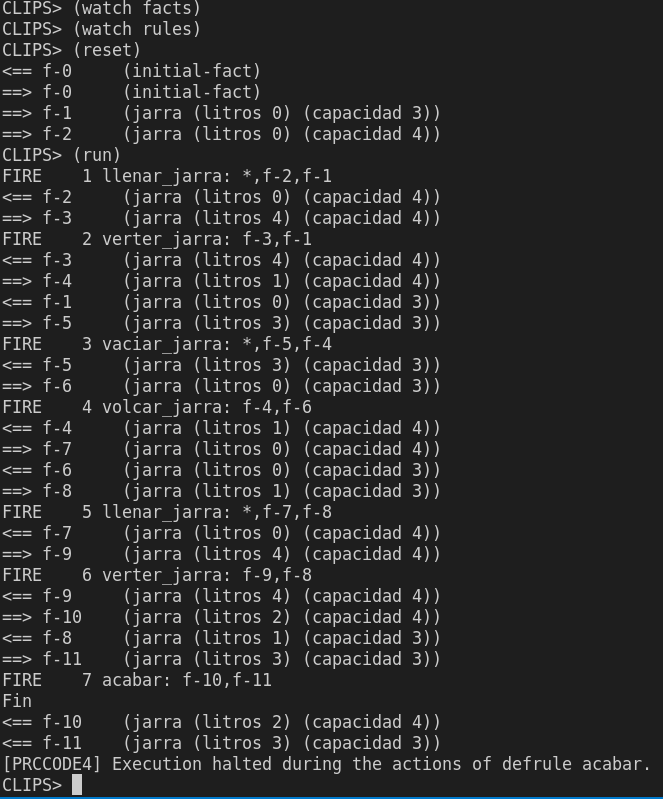

# Carlos III Grado de Ingenieria Informática
## Ingenieria del conocimiento
Tutorial 1: CLIPS y Protege

### Objetivo de la práctica

### Funcionamiento del programa
1. Descargar el repo <br/>
```git clone https://github.com/tiantianana/tutorial_clips.git```
2. cd al directorio raiz. <br/>
```cd tutorial_clips```
3. Ejecutar el programa con el comando `./clips`
4. Cargar los archivos 
```
(load p1.clp)
(watch facts)
(watch rules)
(reset)
(run)
```

